#  pc_wallpager

## 1440x900
```
下载地址: 
https://github.com/ZukGit/Z_Wallpaper/tree/master/zimage/pc_wallpager_photo/1440x900

```


## 1920x1080
```
下载地址: 
https://github.com/ZukGit/Z_Wallpaper/tree/master/zimage/pc_wallpager_photo/1920x1080

```


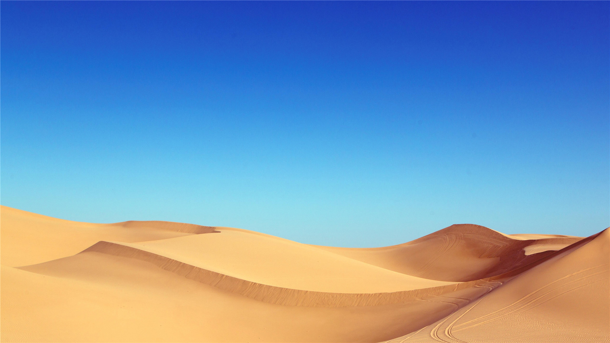

## 1920x1200

```
下载地址: 
https://github.com/ZukGit/Z_Wallpaper/tree/master/zimage/pc_wallpager_photo/1920x1200

```


## 2560x1600

```
下载地址: 
https://github.com/ZukGit/Z_Wallpaper/tree/master/zimage/pc_wallpager_photo/2560x1600

```


## 2880x1880

```
下载地址: 
https://github.com/ZukGit/Z_Wallpaper/tree/master/zimage/pc_wallpager_photo/2880x1880

```


# mobile_wallpager
```
下载地址: 
https://github.com/ZukGit/Z_Wallpaper/tree/master/zimage/mobile_wallpager_photo

```


## 600x1065
```
下载地址: 
https://github.com/ZukGit/Z_Wallpaper/tree/master/zimage/mobile_wallpager_photo/600x1065

```
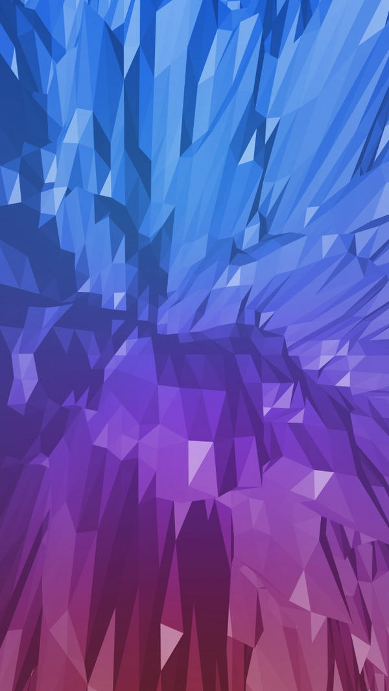


## 640x960
```
下载地址: 
https://github.com/ZukGit/Z_Wallpaper/tree/master/zimage/mobile_wallpager_photo/640x960

```

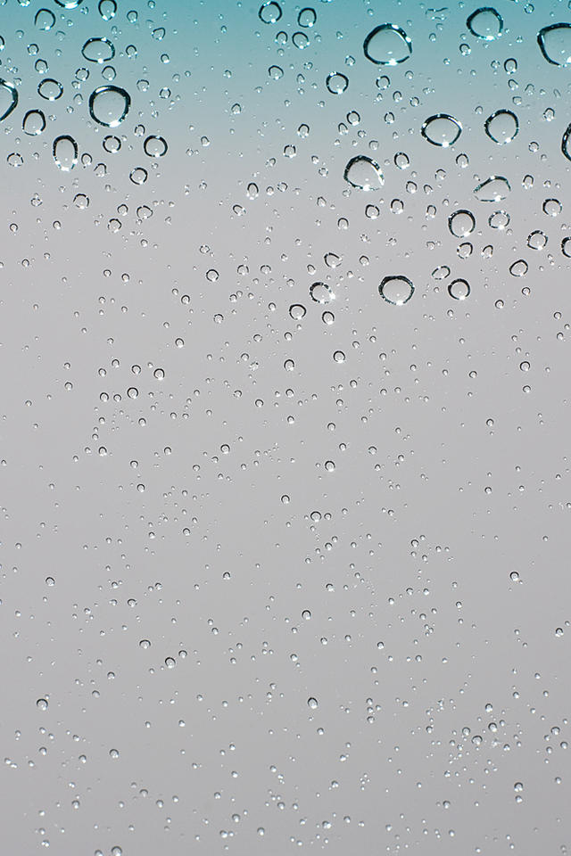
## 640x1136
```
下载地址: 
https://github.com/ZukGit/Z_Wallpaper/tree/master/zimage/mobile_wallpager_photo/640x1136

```

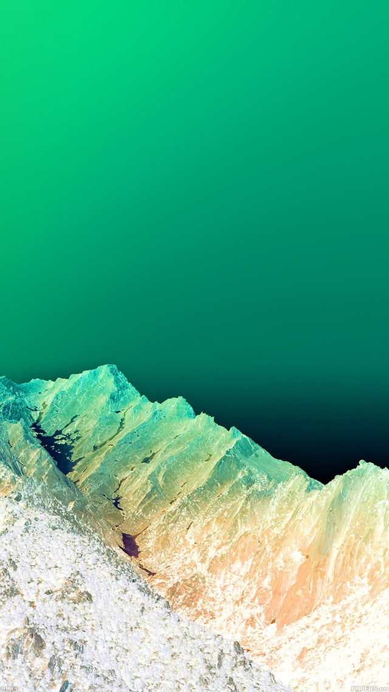


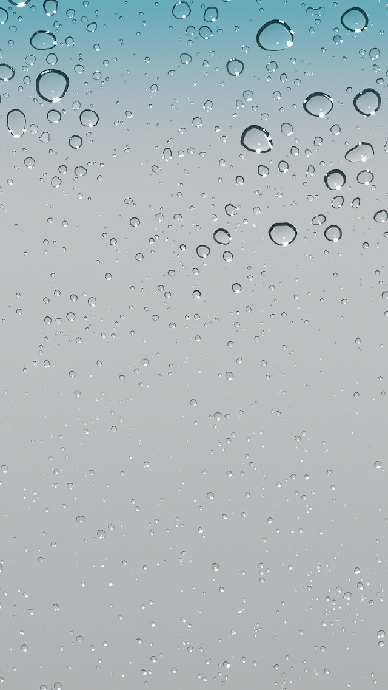

## 720x1280
```
下载地址: 
https://github.com/ZukGit/Z_Wallpaper/tree/master/zimage/mobile_wallpager_photo/720x1280

```


## 750x1334
```
下载地址: 
https://github.com/ZukGit/Z_Wallpaper/tree/master/zimage/mobile_wallpager_photo/750x1334

```
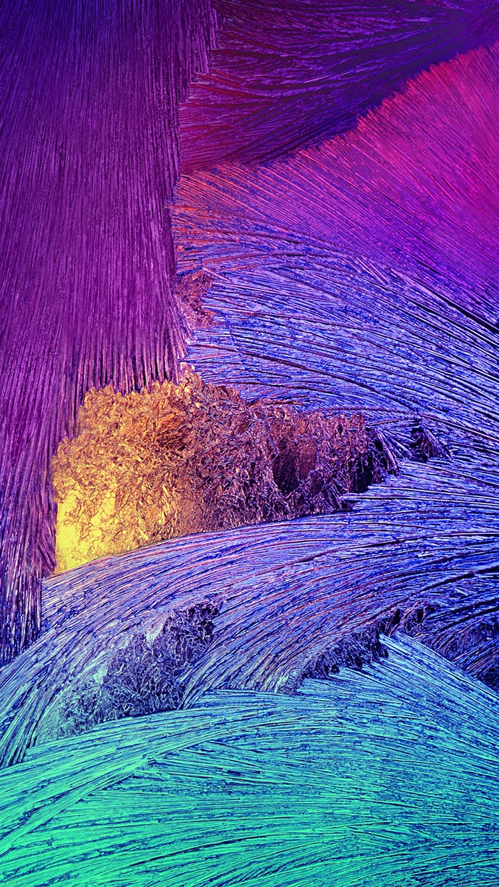

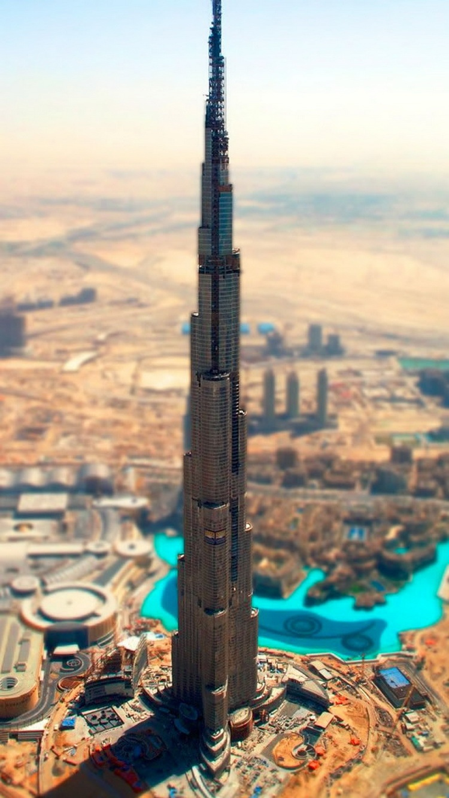


## 960x854
```

下载地址: 
https://github.com/ZukGit/Z_Wallpaper/tree/master/zimage/mobile_wallpager_photo/960x854

```
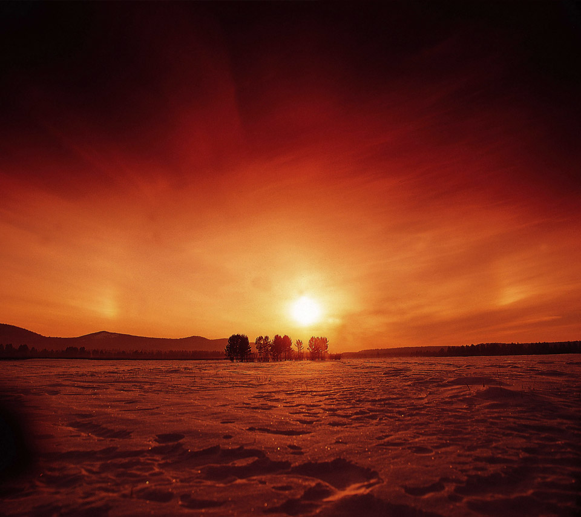


## 1080x1920
```

下载地址: 
https://github.com/ZukGit/Z_Wallpaper/tree/master/zimage/mobile_wallpager_photo/1080x1920

```
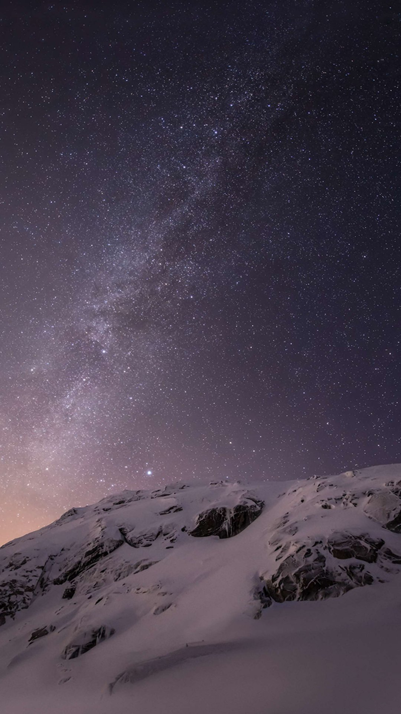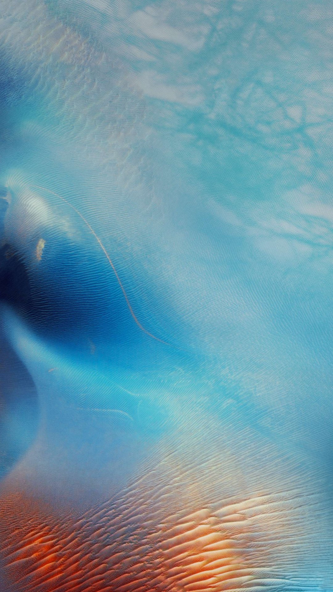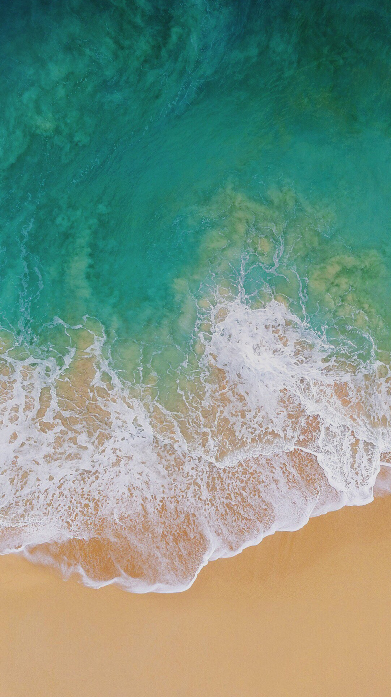
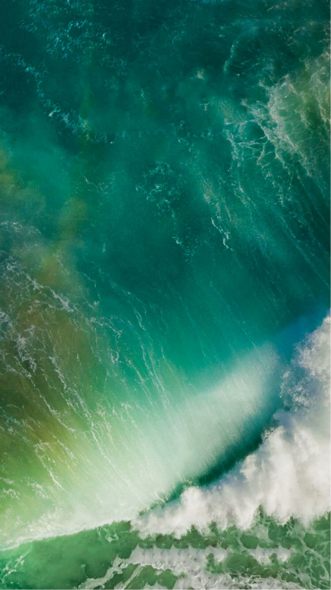


---


# ipad
## 2048x2048
```

下载地址: 
https://github.com/ZukGit/Z_Wallpaper/tree/master/zimage/mobile_wallpager_photo/2048x2048

```


## 2421x2421
```

下载地址: 
https://github.com/ZukGit/Z_Wallpaper/tree/master/zimage/mobile_wallpager_photo/2421x2421

```
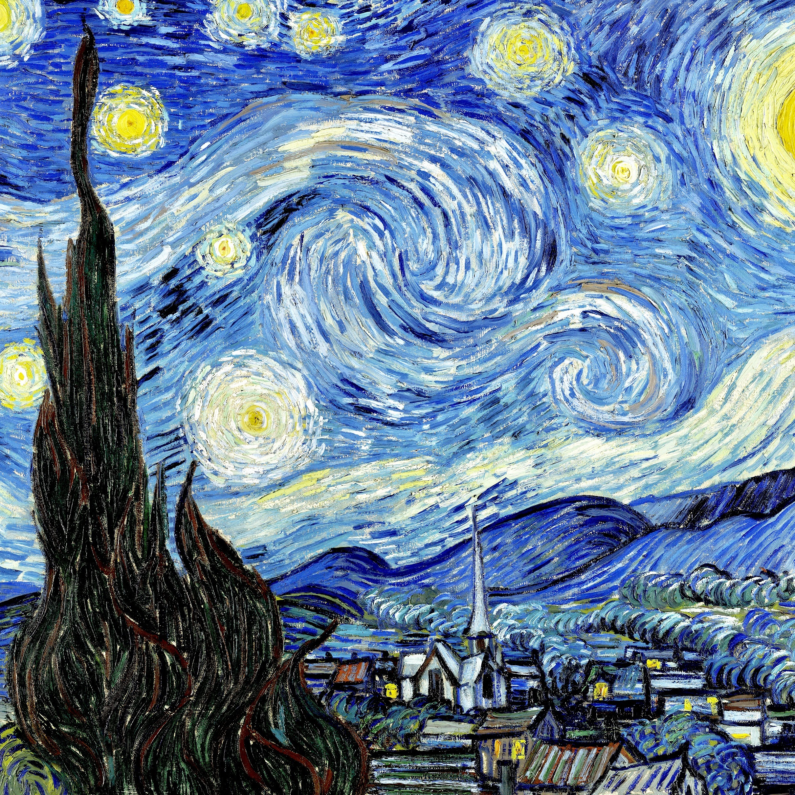


## 3208x3208
```

下载地址: 
https://github.com/ZukGit/Z_Wallpaper/tree/master/zimage/mobile_wallpager_photo/3208x3208

```


# other_photo
```
下载地址: 
https://github.com/ZukGit/Z_Wallpaper/tree/master/zimage/other_photo

```


## 720x640
```
下载地址: 
https://github.com/ZukGit/Z_Wallpaper/tree/master/zimage/other_photo/720x640

```
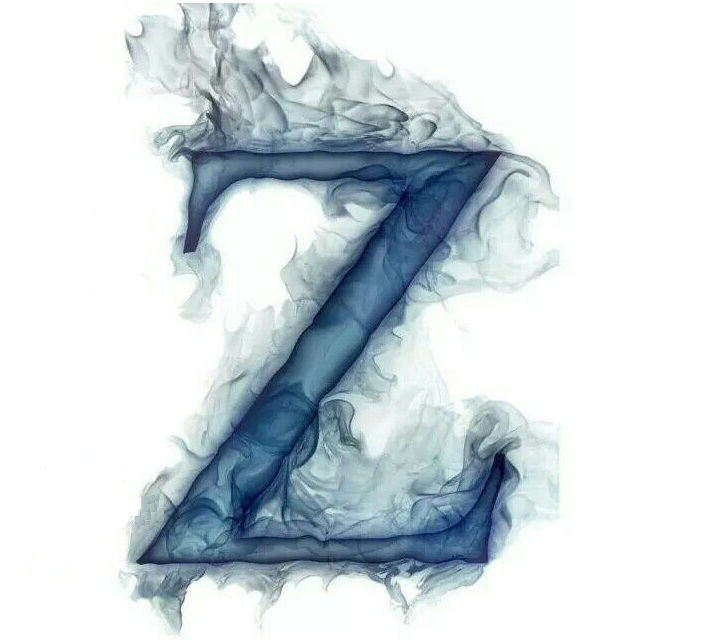

# mobile_theme
```

下载地址: 
https://github.com/ZukGit/Z_Wallpaper/tree/master/zimage/mobile_wallpager_photo/2020x2020

```


## A
## B
## C
## D
## E
## F
## G
## H
### huawei
#### 主题保存地址
```

ADB生效设置:   1.USB文件传输设置  2.开发者选项USB调试打开
主题保存地址:   /sdcard/huawei/Themes
主题后缀名:     xxxxx.hwt
adb push  ./xxxx.hwt    /sdcard/huawei/Themes

```
##### Honor 8 Lite(480dpi 1080x1920)
```

adb shell getprop | grep brand         
[ro.product.brand]: [HONOR]

adb shell getprop | grep name
[ro.config.marketing_name]: [Honor 8 Lite]
[ro.product.name]: [PRA-AL00]


adb shell dumpsys window displays | head -n 3                            
WINDOW MANAGER DISPLAY CONTENTS (dumpsys window displays)
  Display: mDisplayId=0
    init=1080x1920 480dpi cur=1080x1920 app=1080x1794 rng=1080x1008-1795x1722

```

##### IOS11_1
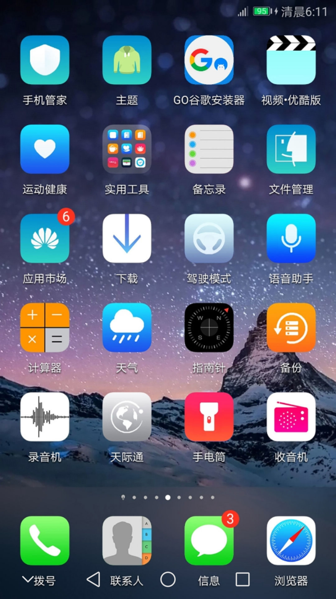

```

下载地址: 
https://github.com/ZukGit/Z_Wallpaper/tree/master/mobile_theme_file/huawei


加载到手机目录命令:
adb push  ./honor8lite_ios_11_1.hwt   /sdcard/huawei/Themes

```

## I
## J
## K
## L
## M
### meizu
#### 主题保存地址
```

主题保存地址:   /sdcard/Customize/Themes
主题后缀名:     xxxxx.mtpk
adb push  ./xxxx.mtpk   /sdcard/Customize/Themes

```
#### M6Note(480dpi 1080x1920)
```
adb shell getprop | grep ro.build.product
[ro.build.product]: [M6Note]


adb shell wm density 
Physical density: 480


shell dumpsys window displays |head -n 3             
WINDOW MANAGER DISPLAY CONTENTS (dumpsys window displays)
  Display: mDisplayId=0
    init=1080x1920 480dpi cur=1080x1920 app=1080x1920 rng=1080x1014-1920x1854

```
##### IOS11_1
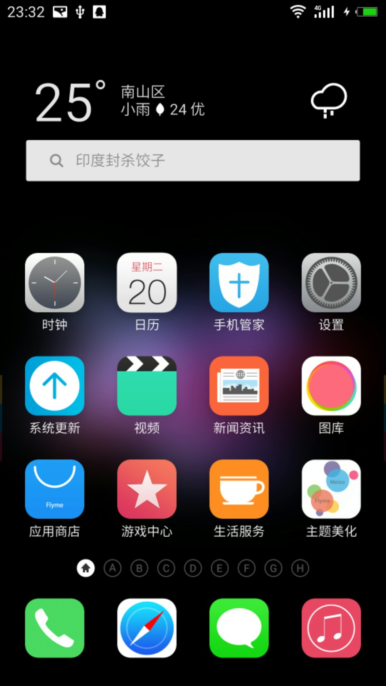

```
下载地址: 
https://github.com/ZukGit/Z_Wallpaper/tree/master/mobile_theme_file/meizu


加载到手机目录命令:
adb push  ./m6note_ios11_1.mtpk   /sdcard/Customize/Themes

```

## N
## O
## P
## Q
## R
## S
## T
## U
## V
## W
## X
## Y
## Z


## 查看手机信息命令
```
1. 查看品牌
adb shell getprop | grep brand  
[ro.product.brand]: [Meizu]

adb shell getprop | grep name
[ro.config.marketing_name]: [Honor 8 Lite]
[ro.product.name]: [PRA-AL00]


2.查看手机机型型号
adb shell getprop | grep ro.build.product
[ro.build.product]: [M6Note]


3.查看手机屏幕像素密度
adb shell wm density 
Physical density: 480

4.查看手机设备的分辨率  cur=1080x1920
adb shell dumpsys window displays | head -n 3             
WINDOW MANAGER DISPLAY CONTENTS (dumpsys window displays)
  Display: mDisplayId=0
    init=1080x1920 480dpi cur=1080x1920 app=1080x1920 rng=1080x1014-1920x1854

```
